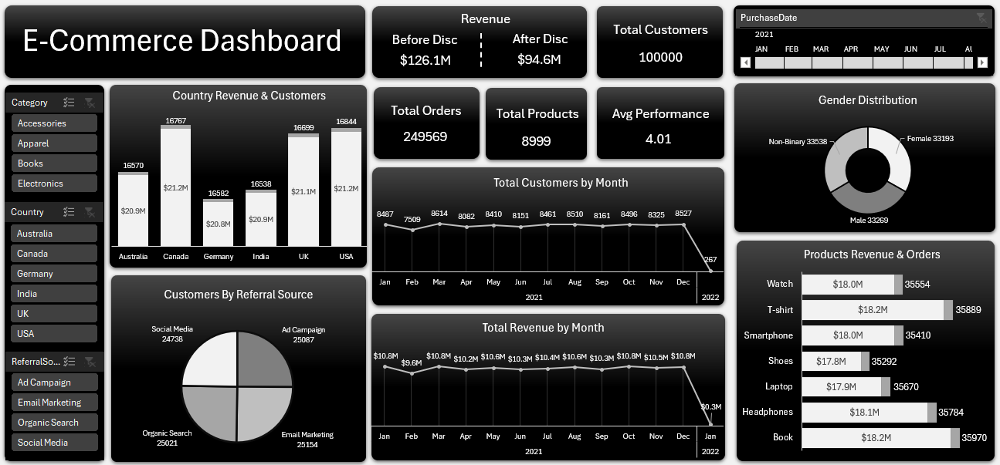

# E-Commerce Sales Analysis

---

## Project Objective
This project is an exploratory data analysis (EDA) of an e-commerce sales dataset. The goal was to understand customer behavior, product performance, sales trends, discount impact, and purchasing patterns across different countries and devices. It is part of a Data Analyst portfolio to demonstrate skills in data cleaning, analysis, and dashboard creation using **Excel**.

---

## Dataset Description
The dataset contains **100,000 transaction records** with information about customers, products, purchases, discounts, reviews, devices, and referral sources. The data covers sales activity from **2021 to 2022** across multiple product categories and countries.

---

## Tools Used
* **Microsoft Excel** – Data cleaning, pivot tables, and dashboard creation
* **Power Query** – Data transformation and preparation

---

## Data Cleaning
Before conducting the analysis, the following data preparation steps were completed to ensure data quality and integrity:

* Verified data types for all columns.
* Formatted the `Purchase Date` column correctly.
* Checked for missing values across all fields.
* Verified data consistency for product and customer information.
* Standardized column names and formats.
* Validated numerical fields such as price, quantity, revenue, and discount rates.

---

## Exploratory Data Analysis (EDA)

### Sales Performance
Analyzed total sales, revenue after discounts, and purchasing volume across different periods to identify overall business performance.

### Product Categories
Compared sales performance across categories including **Apparel, Electronics, Accessories, and Books** to determine the most popular product groups.

### Customers
Explored customer demographics such as age, gender, and country distribution to understand purchasing behavior among different customer segments.

### Discounts
Evaluated the impact of discounts on revenue and purchasing activity by comparing discounted and non-discounted transactions.

### Reviews
Analyzed customer review scores to identify satisfaction levels and overall product feedback trends.

### Devices & Marketing Sources
Examined purchasing behavior across **Desktop, Mobile, and Tablet** users, as well as different referral channels such as **Social Media, Email Marketing, and Organic Search**.

---

## Key Insights

> 📊 **Quick Wins & Highlights:**
> * Total Gross Sales: **>$126 Million**
> * Total Net Revenue (After Discounts): **~$94.6 Million**

* The dataset contains **100,000 sales transactions** across multiple countries and product categories.
* Product demand is distributed across four major categories, providing a balanced product portfolio.
* Customer purchases originate from multiple device types, highlighting the importance of a multi-device shopping experience.
* Discounts have a significant impact on final revenue and purchasing behavior.
* Customer reviews provide valuable insight into product satisfaction and overall shopping experience.

---

## Conclusion
This analysis provides a comprehensive overview of e-commerce sales performance, customer behavior, product demand, and marketing effectiveness. The insights generated from this project can help support strategic decision-making related to **pricing strategies, product management, customer targeting, and revenue optimization**.
